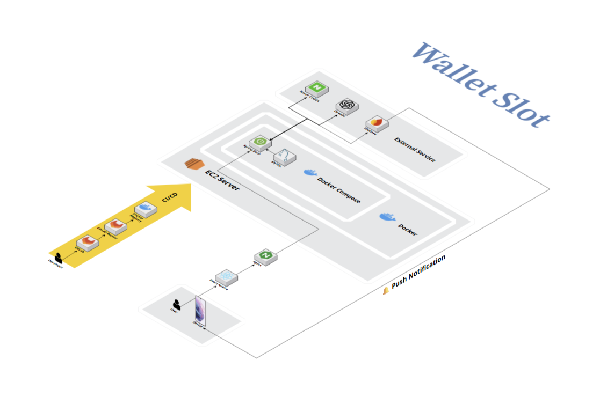

## 포팅 매뉴얼 (Spring Boot + MySQL + Docker Compose + EC2 + React Native)

### 1. 개요
백엔드: Spring Boot, MySQL  
프론트엔드: React Native (모바일 앱)  
배포환경: AWS EC2 (Docker Compose)  

### 2. 시스템 구성도

### 3. 사전 준비물
OS: Ubuntu 20.04 / 22.04 (EC2 AMI 기준)
설치 필요: Docker, Docker Compose

### 4. 프로젝트 다운로드
git clone [Repository](https://lab.ssafy.com/s13-webmobile1-sub1/S13P11B204.git)

### 5. 환경 변수 설정
MYSQL_ROOT_PASSWORD=YOUR_MYSQL_ROOT_PASSWORD
MYSQL_DATABASE=walletslotdb
MYSQL_USER=admin
MYSQL_PASSWORD=YOUR_MYSQL_PASSWORD
SPRING_PROFILES_ACTIVE=prod

DOCKER_REGISTRY=docker.io
DOCKER_REGISTRY_IMAGE=docker.io/YOUR_USERNAME/YOUR_CONTAINER_REGISTRY
DOCKER_REGISTRY_PASSWORD=YOUR_DOCKER_REGISTRY_PASSWORD
DOCKER_REGISTRY_USER=YOUR_DOCKER_USERNAME
SSH_PRIVATE_KEY=YOUR_SSH_PRIVATE_KEY
SPRING_DATASOURCE_URL=jdbc:mysql://mysql-db:3306/walletslotdb?serverTimezone=UTC&useSSL=false&allowPublicKeyRetrieval=true

### 6. Docker Compose 실행
docker-compose build
docker-compose up -d
docker ps 로 컨테이너 상태 확인
backend-app 과 mysql 컨테이너가 떠있어야 정상

### 7. 백엔드 접근
https://j13b108.p.ssafy.io/api
로그 확인: docker logs -f backend-app

### 8. 데이터베이스 초기화
schema.sql, seed date.sql 별도 첨부

### 9. 프론트엔드 실행 (React Native)
cd frontend
npm install
npx react-native start
npx react-native run-android